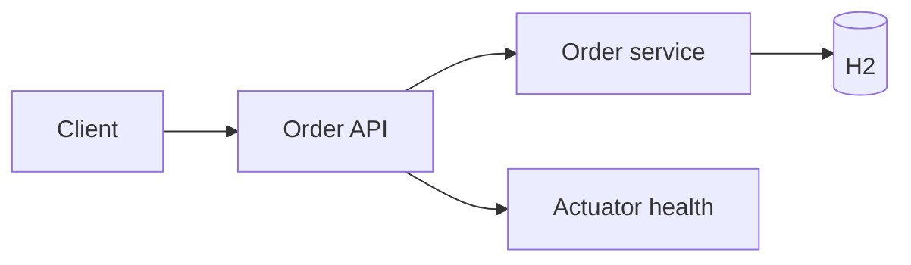

# Architecture

```mermaid
flowchart LR
  C[Client] --> API[Order API]
  API --> S[Order service]
  S --> DB[(H2)]
  API --> H[Actuator health]
```

The demo is intentionally a single deployable service. A database uniqueness constraint backs the idempotency contract; the service handles the user-facing semantics.
